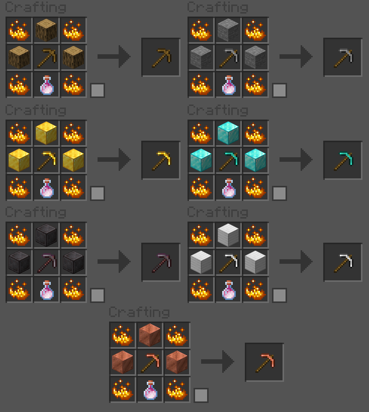

# ⚡ Jodelle Power Mining

[](https://www.spigotmc.org/)
[](https://www.gnu.org/licenses/lgpl-3.0.html)
[]()
[]()

A powerful, modernized **PowerTools plugin** for **Spigot** and **Paper** servers — rebuilt for Minecraft **1.21+**.  
Supercharge your mining, digging, and farming experience with configurable **Hammers**, **Excavators**, and **Plows**.

---

## 🪓 Overview

**Jodelle Power Mining** is a revived and enhanced version of the classic *PowerMining* plugin by [bloodyshade (2013)](https://dev.bukkit.org/profiles/bloodyshade).  
The project was completely rewritten and modernized to bring new life to this powerful tool system — now with JSON configuration, smoother performance, and full WorldGuard compatibility.

💥 **Mine faster.**  
💡 **Dig smarter.**  
⚙️ **Customize everything.**

If you enjoy the plugin, consider **starring the repo ⭐** or donating to support continued updates!

---

## ✨ Features

✔ **Power Tools** – Hammers, Excavators, and Plows with configurable 3×3 area mining & digging.  
✔ **Customizable Recipes** – Fully adjustable crafting recipes using simple JSON files.  
✔ **Configurable Radius & Depth** – Control how large each tool’s effect area is.  
✔ **Permission System** – Fine-grained permissions for crafting, using, and enchanting PowerTools.  
✔ **WorldGuard Support** – Optional integration; region protection is automatically respected.  
✔ **Enchantments Transfer** – Enchanted ingredients pass enchantments to crafted PowerTools.  
✔ **JSON Config System** – No YAML required! Human-readable and easy to modify.  
✔ **Minecraft 1.21+ Compatible** – Built and tested for the latest Spigot & Paper APIs.

---

## 📥 Installation

1. Download the latest `.jar` from the [Releases](https://github.com/mgl23606/JodellePowerMining/releases) page.  
2. Drop it into your server’s `/plugins` folder.  
3. Restart the server.  
4. Configuration files will be automatically generated in `/plugins/JodellePowerMining/`.

---

## ⚙️ Configuration

All configuration files are located in:

```
/plugins/JodellePowerMining/
```

### 📁 Files

| File | Description |
|------|--------------|
| `config.json` | General settings such as mining radius and depth |
| `recipes.json` | Defines PowerTool crafting recipes |
| `mineable.json` | Lists which blocks can be mined by PowerTools |
| `diggable.json` | Lists which blocks can be dug by Excavators |

---

### 🧩 Example – `config.json`

```json
{
  "Radius": 1,
  "Deep": 0
}
```

### 🧱 Example – `recipes.json`

```json
{
  "Recipes": {
    "IRON_HAMMER": [
      "IRON_BLOCK*1", "IRON_BLOCK*1", "IRON_BLOCK*1",
      "EMPTY", "STICK*1", "EMPTY",
      "EMPTY", "STICK*1", "EMPTY"
    ]
  }
}
```

Each slot represents a 3×3 crafting grid (left-to-right, top-to-bottom).  
Use `"EMPTY"` for blank slots. Quantity is specified using `MATERIAL*AMOUNT`.

---

### 🪨 Example – `mineable.json`

```json
{
  "Minable": {
    "STONE": ["any"],
    "IRON_ORE": ["IRON_HAMMER", "DIAMOND_HAMMER"]
  }
}
```

`"any"` means all hammers can mine that block.

---

### 🪣 Example – `diggable.json`

```json
{
  "Diggable": [
    "DIRT",
    "GRASS_BLOCK",
    "SAND"
  ]
}
```

### 🧾 PowerTool Recipes

Here's a visual guide to the crafting recipes for PowerTools:



---

## 🔧 Commands

| Command | Description |
|----------|-------------|
| `/jpm version` | Displays the current plugin version. |
| `/jpm give <player> <tool>` | Gives a player a PowerTool (e.g., `IRON_HAMMER`). |

Example:
```
/jpm give Notch DIAMOND_EXCAVATOR
```

---

## 🔒 Permissions

| Permission | Description |
|-------------|--------------|
| `powermining.use.<type>.<material>` | Allows using a PowerTool (e.g., `powermining.use.hammer.iron`) |
| `powermining.craft.<type>.<material>` | Allows crafting a PowerTool |
| `powermining.enchant.<type>.<material>` | Allows enchanting a PowerTool |
| `jpm.give` | Allows using `/jpm give` |

**Examples:**
```
powermining.craft.hammer.diamond
powermining.use.excavator.netherite
powermining.enchant.plow.iron
```

---

## 🌍 WorldGuard Integration

If **WorldGuard** is installed, PowerMining automatically checks region permissions before breaking blocks.  
If WorldGuard is **not installed**, the plugin continues seamlessly — no errors, no dependency requirements.

---

## 🧠 Technical Notes

- Built for **Spigot/Paper 1.21+** using modern API conventions.  
- Configuration files are **UTF-8 encoded JSON** for better cross-platform compatibility.  
- Plugin gracefully handles missing configs or invalid entries with detailed console logging.  
- Uses **Gson** for configuration and optional integration with **WorldGuard** (v7+).  

---

## 🆕 Changelog

### 📅 November 2025
- 🔄 **Complete Rewrite:** Plugin restructured with modern Java and Spigot 1.21 API.  
- 📦 **New JSON Config System:** Replaces legacy YAML with lightweight JSON.  
- ⚙️ **Optional WorldGuard Support:** Works with or without WG installed.  
- 🪓 **Improved Recipe Parsing:** Handles malformed entries gracefully.  
- 🧰 **Enhanced Permissions:** Automatic generation for all tool/material types.  
- 🧩 **Better Error Logging:** Clear console feedback for missing or invalid configs.  

### 📅 June 2021
- 🛠 Fixed Plow permissions and usage issues.  
- 🔊 Added tool break sounds.  
- 💎 Tools now inherit enchantments when crafted.  
- ✨ Added `/jpm give` and `/jpm version` commands.  

---

## 📜 License

This project is licensed under the **GNU LGPL v3 License**, in accordance with the original plugin by *bloodyshade*.  
See [`LICENSE`](LICENSE) for details.

---

## 💬 Support & Contributions

🐛 **Found a bug?** Open an [issue](https://github.com/mgl23606/JodellePowerMining/issues).  
🔧 **Want to contribute?** Fork the repo, make your changes, and submit a pull request.  
💬 **Need help?** Join our discussions or community Discord (if available).  

---

> ⚡ **Jodelle Power Mining** — Supercharge your mining experience with customizable PowerTools for Spigot & Paper servers!
